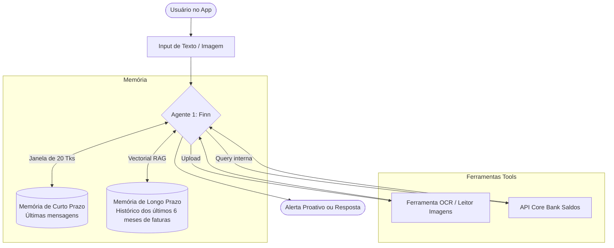
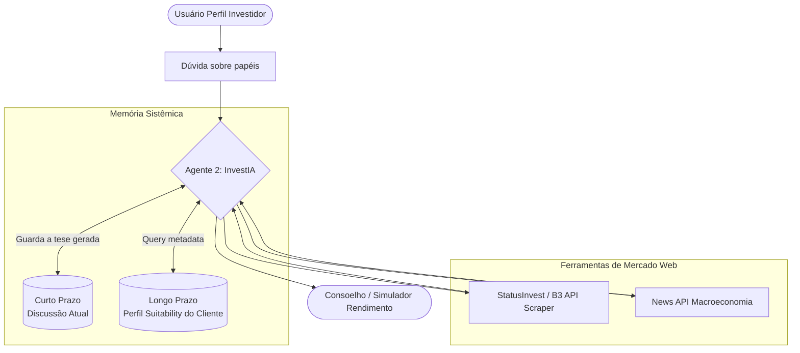
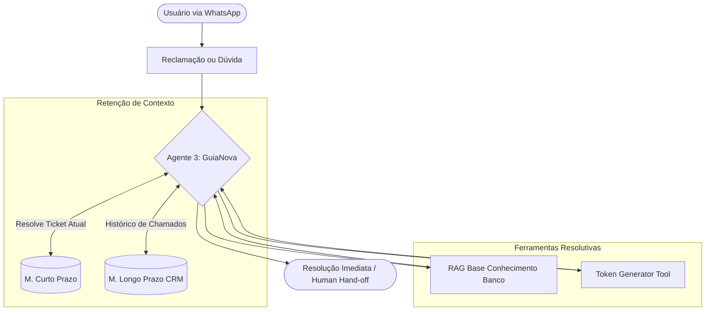

# Trabalho Final: Arquitetura de Agentes de IA
**Projeto: O Renascimento do Banco NovaEra**

---

## 📖 Capítulo 1 — O Cenário
O **Banco NovaEra** despontou como uma das fintechs mais promissoras da última década, atingindo recentemente a impressionante marca de 5 milhões de clientes. Pautado na promessa de ser 100% digital e sem burocracia, o banco viu um crescimento vertiginoso. No entanto, o rápido crescimento trouxe uma forte consequência: **a infraestrutura humana de suporte não escalou na mesma velocidade.** 
Nos últimos meses, o banco observou uma queda preocupante de 15 pontos no NPS (Net Promoter Score). O motivo central? Clientes perdendo tempo na fila do *call center* para tirar dúvidas básicas sobre faturas; investidores inexperientes frustrados com o home-broker sem suporte consultivo; e um aplicativo que apenas "exibia números", sem ajudar de fato na gestão da saúde financeira dos correntistas.

Havia uma necessidade latente de inovação. A diretoria deu o aval para a criação de um squad de Inteligência Artificial para não apenas conter os danos, mas para mudar o jogo, oferecendo uma experiência hiper-personalizada 24 horas por dia.

---

## 🔍 Capítulo 2 — A Descoberta
Nossa equipe de Customer Experience engajou em sprints de "Design Thinking" com os clientes. Após compilar chamados de ouvidoria e pesquisas estruturadas, identificamos três frentes prioritárias que moldariam o futuro do Banco NovaEra:

1. **A Dor do Salário que Some:** 60% dos clientes afirmavam que perdiam o controle ao longo do mês. Eles queriam que o banco fosse um parceiro ativo na gestão, e não um simples extrato reflexivo pós-gasto.
2. **A Barreira do Risco:** 45% do montante na poupança poderia ser convertido para ativos de maior margem, mas os clientes tinham "medo de investir" por falta de vocabulário e ausência de um consultor (privilégio apenas de clientes Private).
3. **O Gargalo Operacional:** Dos mais de 100 mil chamados mensais, 40% se tratavam de dúvidas genéricas como limite de PIX, tarifas e senhas bloqueadas.

O veredito era claro: criar um modelo de super-app focado não em módulos tradicionais, mas alimentado por **Três Especialistas de Inteligência Artificial**, operando de maneira completamente independente e hiper-especializada.

---

## 💡 Capítulo 3 — A Proposta de Solução

Para garantir foco, segurança da informação e evitar que um Agente de FAQ cometesse um erro crítico de recomendação de investimentos, propusemos o desenvolvimento de três agentes virtuais autônomos.

### Agente 1: "Finn" — O Consultor Financeiro Pessoal
**Público-alvo:** Clientes de varejo.
**Atuação:** Ajuda na categorização automática e leitura de documentos.
**Diferencial de Valor:** Capaz de usar ferramentas de OCR. Um cliente pode mandar a foto de um boleto estranho e dizer "Finn, isso aqui cabe no meu orçamento desse mês para eu pagar hoje?", e o agente cruzará as entradas passadas, o orçamento e extrairá os dados da imagem.

### Agente 2: "InvestIA" — O Assessor de Capital
**Público-alvo:** Investidores nível Iniciante a Intermediário.
**Atuação:** Atua sugerindo renda fixa, ações e cruzando com o perfil Suitability do usuário (Conservador/Arrojado).
**Diferencial de Valor:** O Agente usará APIs de mercado ativas para puxar tesouro direto, relatórios e cotações reais para debater portfólio. (Não tem permissão de efetuar ordens sem confirmação humana direta via PIN, operando apenas como conselheiro).

### Agente 3: "GuiaNova" — A Especialista de Operações
**Público-alvo:** Toda a base (Foco em Backoffice/SAC).
**Atuação:** Especialista em regras bancárias internas.
**Diferencial de Valor:** Atende dúvidas, reset de senha e regras de TED. Utiliza "Long Term Memory" para saber a jornada do usuário. Se o usuário ligar ele sabe "Vi aqui que sua conta sofreu bloqueio ontem à noite. Você quer resolver isso?".

---

## 🏛️ Capítulo 4 — Diagramas e Design dos Agentes

*(Os diagramas a seguir representam o framework lógico mapeando as Memórias e as Ferramentas externas no padrão ReAct)*

### 4.1. Design do "Finn" - Gerenciador Financeiro

### 4.2. Design da "InvestIA" - Assessment

### 4.3. Design da "GuiaNova" - FAQ Omnichannel

---

## 📱 Capítulo 5 — A Jornada do Cliente (Simulações)

### Cenário 1: O susto do Boleto com Agente Finn
**Cliente:** *(Envia imagem do boleto de condomínio de R$ 950)* "Finn, veio muito alto esse boleto. Tenho saldo e limite?"
**Finn (Agente 1):** *(Lê imagem com OCR - Ferramenta 1)* - "Olá João. Notei que seu boleto do condomínio veio R$ 950 este mês (R$ 150 a mais que o mês passado guardado no meu histórico). Você tem R$ 1.200 na conta atual *(API Core)*, mas faltará dinheiro para a fatura do cartão na semana que vem. Sugiro agendarmos para o dia 5, que é o dia que cai o seu salário."

### Cenário 2: Quebra de objeção com InvestIA
**Cliente:** "Queria colocar 5 mil num FII, mas tô com medo porque o juros subiu."
**InvestIA (Agente 2):** "Com a SELIC alta, os fundos de papel realmente podem render diferente. Segundo seu perfil Conservador *(Memória Longa)*, uma oscilação na cota vai te causar dor de cabeça. Busquei via *StatusInvest* e encontrei CDBs oferecendo 115% do CDI, que trava seu ganho com muito mais segurança. O que acha de dividirmos, R$ 4 mil em CDB e R$ 1 mil num fundo de tijolo como HGLG11 para você testar?"

### Cenário 3: Resolução Omnichannel com GuiaNova
**Cliente:** "Meu cartão do novaera não passou."
**GuiaNova (Agente 3):** "Oi Maria! Eu vi aqui no seu histórico *(CRM Tool)* que você pediu o desbloqueio para viagem internacional ontem logo após usar no aeroporto. A transação em Portugal gerou bloqueio por falha na localização do App. Acabei de ativar o Token no seu celular, você só precisa apertar OK lá e pode passar o cartão na maquininha de novo!"

---

## 🔎 Capítulo 6 — Avaliação dos Agentes

Como em instituições bancárias não há margem para alucinações (LLM Hallucination), métricas rigorosas serão implantadas.

- **Agente 1 (Financeiro):** LLM-as-a-Judge test. Diariamente amostramos saídas e um modelo superior roda de forma não-supervisionada checando se: *O Agente sugeriu o cliente a ficar no vermelho sem emitir um alerta?* Caso positivo, o Prompt é modificado em *shadow deploy*.
- **Agente 2 (Investimentos):** Aderência (Fidelity RAG). O cálculo feito nos relatórios macroeconômicos deve bater 100% com o resultado no chat antes do delivery, interceptando matematicamente. Se a resposta envolve "Selic", o roteador do sistema bloqueia o chat até uma API cruzar o número atual com o texto gerado. 
- **Agente 3 (FAQ):** Teste A/B clássico voltado ao FCR (First Contact Resolution). Quantos chamados tratados pela *GuiaNova* fluíram para a fila humana em comparação aos que caíram no Bot legad0? A meta é reduzir transbordos humanos para menos de 10% do funil.

---

## 📈 Capítulo 7 — Benefícios e Impacto Esperado

1. **Aumento Direto no NPS e Cross-Sell:** A personalização profunda (com o Finn e InvestIA lembrando detalhes do cliente) cria afinidade. Ao desmistificar investimentos ativamente, aumentamos o montante aportado (*AUM - Assets Under Management*) do banco.
2. **Redução e Agilidade Operacional:** A expectativa é abater 45% do L1 (nível 1) de suporte no primeiro semestre e economizar R$ 10MM anuais com os chamados rotineiros respondidos por RAG avançado.
3. **Escalando o Atendimento VIP:** Um "gerente de banco" só é plausível numa agência em formato "1 para cada N mil". O Agente viabiliza "1 gerente super-inteligente para cada cliente" 24/7.

---

## 🚀 Capítulo 8 — Lições, Riscos e Próximos Passos

O risco de expor Inteligência Artificial generativa no banco sempre tange ao aspecto de **Viés (Bias)** e **Desalinhamento Institucional**. O desenvolvimento desta prova de tese alertou o time de Inovação para o fato de que a fronteira de contexto deve ser estreita e vigiada — por isso se separou a Arquitetura em 3 agentes não comunicantes, mitigando vulnerabilidades num modelo de Segurança Zero Trust de Prompt.

**Os Próximos Passos (Visão V2):** 
1. Após maturidade da plataforma, implantar um *Agente Supervisor Roteador* (Orchestrator). Ele será a porta de entrada única do Banco NovaEra, e sem que o cliente saiba, repassará a conversa ativamente para a *GuiaNova*, *Finn* ou *InvestIA* rodando em Background.
2. Voice Agents Ativos. Implementar o protocolo de voz nativo da OpenAI para que clientes com acessibilidade ou pressa possam literalmente ligar para o Fin ou InvestIA, num fluxo hiper realista de voz.

*Fim da documentação analítica de arquitetura AI - NovaEra Bank.*
